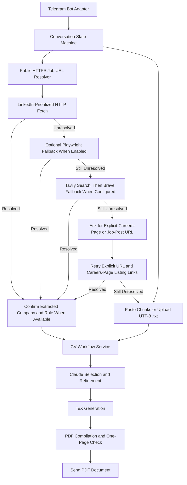

# Telegram CV Agent Workflow Plan

This document is the development reference for the Telegram CV agent workflow.

## Suggested Architecture

Use a Telegram bot running on a Mac. Phase 2 accepts generic public HTTPS job URLs after `/new`,
prioritizes LinkedIn postings, and keeps pasted text chunks and UTF-8 `.txt` documents as a
deterministic fallback.

```text
Telegram /new
  -> send a public HTTPS job URL
       -> extract with an HTTP request first
       -> prefer JobPosting JSON-LD, then DOM block scoring
       -> use timed Trafilatura or Tensorix boundary fallback only for ambiguous text
       -> optionally retry with Playwright when configured
       -> if direct extraction fails, search with Tavily, then Brave, when configured
       -> ask for an explicit careers-page or job-post URL retry when needed
  -> or paste description chunks or upload a UTF-8 .txt document
  -> ask for optional CV instructions
  -> run existing Claude generation workflow
  -> compile and verify one-page PDF
  -> send PDF back through Telegram

Further text message
  -> refine active job folder
  -> route simple edits locally and larger edits through scoped LLM context
  -> regenerate PDF
  -> send updated PDF

Future job-board adapters
  -> add Indeed and GradIreland handling
  -> follow the same workflow
```

For a personal MVP, long polling is enough. A public web server, domain, HTTPS endpoint, and
database server are not initially required. The Mac only needs to remain online while the bot is
in use.

## Flowchart



The transport adapter should remain separate from the CV workflow. This makes WhatsApp an
additional adapter later rather than a rewrite.

## Refinement Context Router

The refinement workflow now routes feedback before spending the full Claude refinement context. The
router keeps full-context Claude refinement as the safe fallback and never replaces the YAML source
of truth.

The first step is a tiny deterministic fast path for exact local commands only: show/hide coursework,
show/hide education bullets, show/hide experience technologies, show/hide project technologies, and
remove `additional_information`. Everything else goes to a small Tensorix planner when
`TENSORIX_API_KEY` is available from the environment, `.env.local`, or `.env`. The default planner
model is `minimax/minimax-m2.5`, with `CV_ROUTER_MODEL` available as an override.

The planner returns a validated structured action and one of these routes:

1. **Deterministic local edit:** Apply safe job-specific changes such as toggling display fields,
   removing a selected item, or removing a section without calling the larger LLM.
2. **Compact LLM refinement:** For wording or layout changes that only affect the current CV, send
   the feedback with current requirements, job config, selection, and generated `.tex` file. Omit
   the candidate inventory and job description.
3. **Full-context refinement:** For requests that may add, replace, emphasize, or reselect career
   evidence, run the existing full-context workflow with the compact candidate inventory.

Keep `job_config.yaml` and `selection.yaml` as the durable source of truth for every route, validate
all changes, regenerate `.tex`, and compile the PDF normally. The generated `.tex` file can help the
planner understand presentation-level changes, but direct TeX-only edits would be overwritten by a
later regeneration and would make future refinements harder to reproduce.

If the Tensorix planner is missing, unavailable, low-confidence, or returns invalid JSON, the router
uses the existing full-context refinement path.

## Future Supermemory Integration

Use Supermemory as a searchable derived index, not as the source of truth:

| Component | Responsibility |
| --- | --- |
| `data/master.private.yaml` | Authoritative personal career database |
| Job folder YAML files | Reproducible state for each generated CV |
| Local SQLite | Telegram conversation state |
| Supermemory | Searchable career evidence, preferences, and job history |

The future Supermemory integration should plug into the existing router's full-context route:

```text
Telegram refinement feedback
  -> Tensorix planner
  -> simple structured edit?
        yes: update job YAML locally and regenerate PDF
        no: does the request need additional career evidence?
             no: send current CV state only
            yes: search Supermemory for relevant evidence
                 -> send the top matching snippets to Claude
                 -> fall back to the compact candidate inventory if needed
```

Useful later applications:

- Store explicit stable preferences such as common exclusions, preferred CV tone, and section
  ordering.
- Retrieve similar past CVs and feedback when tailoring a new CV for a related role.
- Index old CVs, LinkedIn exports, project notes, certificates, and portfolio text from local raw
  inputs after review.
- Track application history: company, role, generated job folder, date, and user feedback.
- Improve LinkedIn URL intake by retrieving similar applications and reusable evidence.

Guardrails:

- Do not replace `data/master.private.yaml` with Supermemory.
- Do not store API keys, Telegram tokens, or private credentials.
- Do not write every Telegram message into long-term memory automatically.
- Store user-approved preferences and reviewed derived evidence only.
- Validate retrieved IDs against the YAML database before generation.
- Scope records with container tags and metadata such as candidate, job, evidence type, and
  application status.

## Operational Requirements

- Whitelist the Telegram user ID.
- Store the bot token and Anthropic key outside Git.
- Read optional `TAVILY_API_KEY` and `BRAVE_SEARCH_API_KEY` values from ignored local environment
  configuration. Do not persist search keys in Telegram state, job folders, prompts, or generated files. Direct LinkedIn
  and other public job URLs must remain usable without either search key.
- Enable optional Playwright rendering only when `TELEGRAM_RESOLVER_PLAYWRIGHT=1` is configured and
  Playwright with Chromium is installed. Keep HTTP extraction and text fallbacks available without it.
- Keep `data/master.private.yaml` local.
- Process generation in a background worker so the bot remains responsive.
- Send plain-language status updates while resolving a URL, retrieving a posting, generating a CV,
  and compiling a PDF. Confirm the extracted company and role when available.
- Apply URL safety checks before retrieval: accept public HTTPS URLs only and reject unsafe targets.
- Serialize refinements per chat to avoid two messages updating the same job folder concurrently.
- Retain the existing job folders as an audit trail.
- Record failures and send actionable fallback prompts.
- Discard offline Telegram messages on startup. Require `/new` for a new job or `/refine` to select
  an existing generated CV after every process restart.
- Provide `/reset` to clear the current chat session and selected CV without deleting generated job
  folders.

## Realistic Delivery Plan

### Phase 1: Telegram Bot With Pasted Descriptions

Status: implemented.

Estimated effort: 1-2 focused days.

This proves messaging, SQLite state management, generation, refinement, and PDF delivery with
minimal risk. Job descriptions can be sent as pasted text chunks or UTF-8 `.txt` files.

### Phase 2: Public HTTPS Job URL Resolver

Status: implemented.

After `/new`, accept generic public HTTPS URLs with LinkedIn-prioritized handling. LinkedIn job URLs
use a low-latency pipeline: extract the job ID, fetch the submitted URL with plain HTTP, prefer
structured `JobPosting` JSON-LD, then use deterministic section filtering, then the Tensorix
small-LLM job-description filter only when deterministic filtering is unreliable. LinkedIn skips
Playwright, Trafilatura, and the boundary planner by default.

If the submitted LinkedIn page fails, run one search/discovery pass with the LinkedIn job ID and try
only the top ranked discovered candidate that contains the same job ID. If that candidate does not
yield a fast reliable description, ask for a careers-page URL or pasted description. Non-LinkedIn
URLs keep the generic direct-first extraction path with optional Playwright and configured
Tavily/Brave fallback search.
Keep API keys in ignored local environment configuration. Confirm the extracted company and role
when available.

Resolver decisions are backend-only diagnostics, not Telegram-facing messages. The macOS service
captures `[resolver.route]`, `[resolver.extract]`, and `[resolver.service]` logs in the repo-local
log files. LinkedIn route logs include the fast-pipeline strategy, direct/discovered fetch path,
filter method, elapsed time, final URL, and terminal decision.

### Phase 3: Always-On Deployment

Status: implemented for local macOS Login Service deployment.

Estimated effort: 1-3 additional days.

The local deployment path keeps the Telegram bot running through a per-user LaunchAgent. The checked
in service runner changes into `/Users/adityakharbanda/cv-system`, exports
`CV_MASTER_DATA=data/master.private.yaml`, sets a `PATH` that can find `uv`, and runs the existing
`scripts/run_telegram_bot.py` entrypoint. Telegram, Anthropic, and optional search keys stay in the
ignored `.env.local` or `.env` files already read by the application.

Use `scripts/telegram_bot_service.sh install` to copy the LaunchAgent plist into
`~/Library/LaunchAgents`, then `scripts/telegram_bot_service.sh start` to bootstrap it into
`gui/$UID`. The plist uses `RunAtLoad=true`, `KeepAlive=true`, and repo-local stdout/stderr logs
under `logs/`. The same control script supports `status`, `restart`, `stop`, and `uninstall`.

Container or VPS deployment remains out of scope for this phase.

### Phase 4: WhatsApp Adapter

Estimated effort: 2-5 additional days, plus Meta setup time.

Indeed and GradIreland URL adapters remain future extensions of the Phase 2 resolver.

### Phase 5: Refinement Context Router

Status: implemented for Tensorix-planned routing with full-context fallback.

The implemented router uses exact deterministic local edits for a small safe command set, then a
Tensorix planner for route selection. Compact refinement omits the candidate inventory, and any
missing, invalid, or low-confidence planner decision falls back to the existing full-context Claude
refinement route. Relevant-record retrieval remains Phase 6 work.

### Phase 6: Supermemory Retrieval Layer

Estimated effort: 2-4 focused days after the context router exists.

1. Add a small Supermemory adapter behind an internal interface.
2. Index reviewed career evidence from `data/master.private.yaml` with scoped tags and metadata.
3. Use retrieval only for refinements that need additional career evidence.
4. Measure prompt-token use and CV quality against the compact candidate-inventory fallback.
5. Add approved preference memory and similar-application retrieval after evidence retrieval is
   stable.
