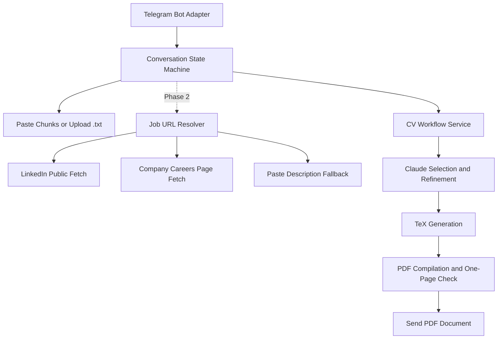

# Telegram CV Agent Workflow Plan

This document is the development reference for the Telegram CV agent workflow.

## Suggested Architecture

Use a Telegram bot running on a Mac. Phase 1 is implemented with pasted text chunks and UTF-8
`.txt` documents as job-description inputs. LinkedIn URL retrieval remains Phase 2.

```text
Telegram /new
  -> paste description chunks or upload a .txt document
  -> ask for optional CV instructions
  -> run existing Claude generation workflow
  -> compile and verify one-page PDF
  -> send PDF back through Telegram

Further text message
  -> refine active job folder
  -> route simple edits locally and larger edits through scoped LLM context
  -> regenerate PDF
  -> send updated PDF

Future LinkedIn URL
  -> retrieve job description
  -> follow the same workflow
```

For a personal MVP, long polling is enough. A public web server, domain, HTTPS endpoint, and
database server are not initially required. The Mac only needs to remain online while the bot is
in use.

## Flowchart



The transport adapter should remain separate from the CV workflow. This makes WhatsApp an
additional adapter later rather than a rewrite.

## Future Refinement Context Router

The current refinement workflow sends Claude the existing job description, requirements, validated
job config, validated selection, and a compact candidate inventory. It does not send the raw private
master YAML file, but the repeated candidate inventory still adds avoidable tokens for small edits.

Add a lightweight refinement planner after `/refine` selects a CV. The planner should return a
validated structured action and one of these routes:

1. **Deterministic local edit:** Apply safe job-specific changes such as hiding a profile link,
   removing a selected item, or removing a section without calling the larger LLM.
2. **Compact LLM refinement:** For wording or layout changes that only affect the current CV, send
   the feedback with the current job config, selection, and generated `.tex` file. Omit the
   candidate inventory.
3. **Retrieved or full-context refinement:** For requests that add or replace career evidence,
   retrieve relevant records from the private master data or send the compact candidate inventory,
   then run the full refinement workflow.

Keep `job_config.yaml` and `selection.yaml` as the durable source of truth for every route, validate
all changes, regenerate `.tex`, and compile the PDF normally. The generated `.tex` file can help the
planner understand presentation-level changes, but direct TeX-only edits would be overwritten by a
later regeneration and would make future refinements harder to reproduce.

Adding a skill is not always a presentation-only edit: the skill should already exist in the master
data or be handled as an explicit data update. Hiding a profile link also needs a job-specific
display override so it does not mutate the candidate's global profile.

## Operational Requirements

- Whitelist the Telegram user ID.
- Store the bot token and Anthropic key outside Git.
- Keep `data/master.private.yaml` local.
- Process generation in a background worker so the bot remains responsive.
- Send status updates such as `Retrieving posting`, `Generating CV`, and `Compiling PDF`.
- Serialize refinements per chat to avoid two messages updating the same job folder concurrently.
- Retain the existing job folders as an audit trail.
- Record failures and send actionable fallback prompts.
- Discard offline Telegram messages on startup. Require `/new` for a new job or `/refine` to select
  an existing generated CV after every process restart.
- Provide `/reset` to clear the current chat session and selected CV without deleting generated job
  folders.

## Realistic Delivery Plan

### Phase 1: Telegram Bot With Pasted Descriptions

Status: implemented.

Estimated effort: 1-2 focused days.

This proves messaging, SQLite state management, generation, refinement, and PDF delivery with
minimal risk. Job descriptions can be sent as pasted text chunks or UTF-8 `.txt` files.

### Phase 2: LinkedIn URL Resolver

Estimated effort: 1-3 additional days for a best-effort personal version.

Add public-page retrieval, content validation, company careers-page handling, and pasted-text
fallback. The fallback is important because LinkedIn retrieval will occasionally fail.

### Phase 3: Always-On Deployment

Estimated effort: 1-3 additional days.

Either:

- keep the Telegram bot running as a macOS background service, or
- deploy a container with Python, LaTeX tooling, `pdfinfo`, secrets, private master data, and
  SQLite storage.

### Phase 4: WhatsApp Adapter

Estimated effort: 2-5 additional days, plus Meta setup time.

### Phase 5: Refinement Context Router

Estimated effort: 2-4 focused days.

Add the lightweight planner, structured local-edit actions, job-specific display overrides,
compact refinement prompts, and relevant-record retrieval. Measure prompt sizes and preserve the
existing full-context refinement route as a fallback.
