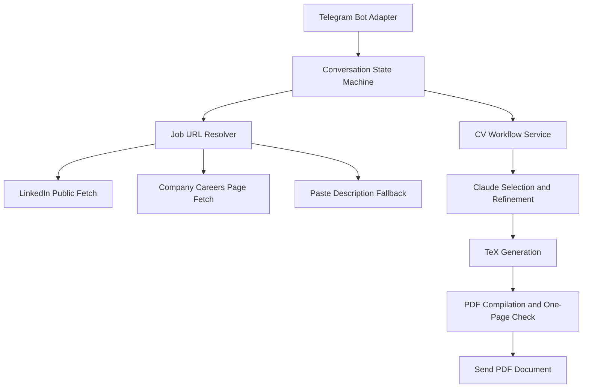

# Telegram CV Agent Workflow Plan

This document is the development reference for the Telegram CV agent workflow.

## Suggested Architecture

Use a Telegram bot running on a Mac.

```text
Telegram message
  -> detect LinkedIn URL
  -> retrieve job description
  -> ask for optional CV instructions
  -> run existing Claude generation workflow
  -> compile and verify one-page PDF
  -> send PDF back through Telegram

Further text message
  -> refine active job folder
  -> regenerate PDF
  -> send updated PDF

New LinkedIn URL
  -> start a new job session
```

For a personal MVP, long polling is enough. A public web server, domain, HTTPS endpoint, and
database server are not initially required. The Mac only needs to remain online while the bot is
in use.

## Flowchart



The transport adapter should remain separate from the CV workflow. This makes WhatsApp an
additional adapter later rather than a rewrite.

## Operational Requirements

- Whitelist the Telegram user ID.
- Store the bot token and Anthropic key outside Git.
- Keep `data/master.private.yaml` local.
- Process generation in a background worker so the bot remains responsive.
- Send status updates such as `Retrieving posting`, `Generating CV`, and `Compiling PDF`.
- Serialize refinements per chat to avoid two messages updating the same job folder concurrently.
- Retain the existing job folders as an audit trail.
- Record failures and send actionable fallback prompts.

## Realistic Delivery Plan

### Phase 1: Telegram Bot With Pasted Descriptions

Estimated effort: 1-2 focused days.

This proves messaging, state management, generation, refinement, and PDF delivery with minimal
risk.

### Phase 2: LinkedIn URL Resolver

Estimated effort: 1-3 additional days for a best-effort personal version.

Add public-page retrieval, content validation, company careers-page handling, and pasted-text
fallback. The fallback is important because LinkedIn retrieval will occasionally fail.

### Phase 3: Always-On Deployment

Estimated effort: 1-3 additional days.

Either:

- keep the Telegram bot running as a macOS background service, or
- deploy a container with Python, LaTeX tooling, `pdfinfo`, secrets, private master data, and
  SQLite storage.

### Phase 4: WhatsApp Adapter

Estimated effort: 2-5 additional days, plus Meta setup time.
